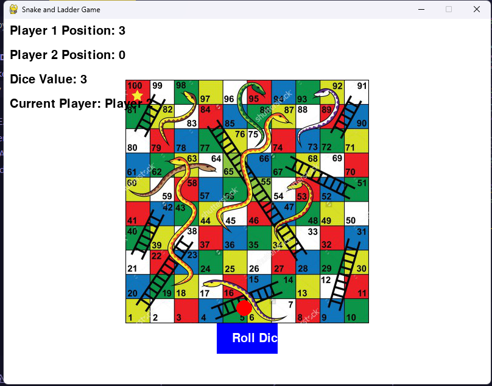

# Snake-and-Ladder-using-speech-recognition

# Snake and Ladder using Speech Recognition

This Python program combines the classic game of Snake and Ladder with speech recognition capabilities.

## Required Imports

```python
import pygame
import random
import speech_recognition as sr
```
pygame: The pygame library is used for developing games and multimedia applications in Python. It handles graphical interfaces, user input, and displaying game elements.

random: The random module provides functions for generating random numbers, often used in games to introduce unpredictability.

speech_recognition: The speech_recognition library enables speech recognition in Python. It allows the program to recognize speech from various audio sources like microphones or audio files.

The program utilizes pygame for game development, random for generating random numbers, and speech_recognition for voice commands and voice-controlled interactions within the game.

Please note that the provided markdown code is a description of the program's imports and functionality. The actual implementation logic and game mechanics may require additional code and dependencies.

Remember to import the required libraries and customize the program's logic to fit your specific requirements and game design
